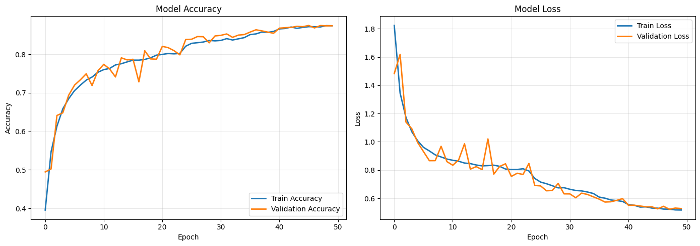
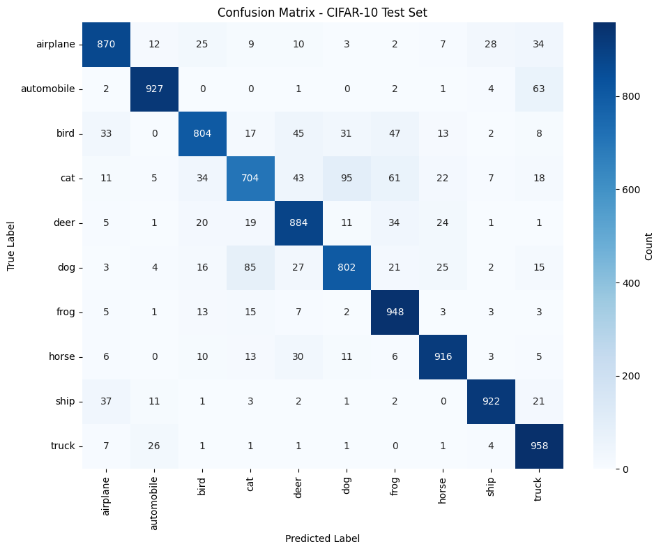
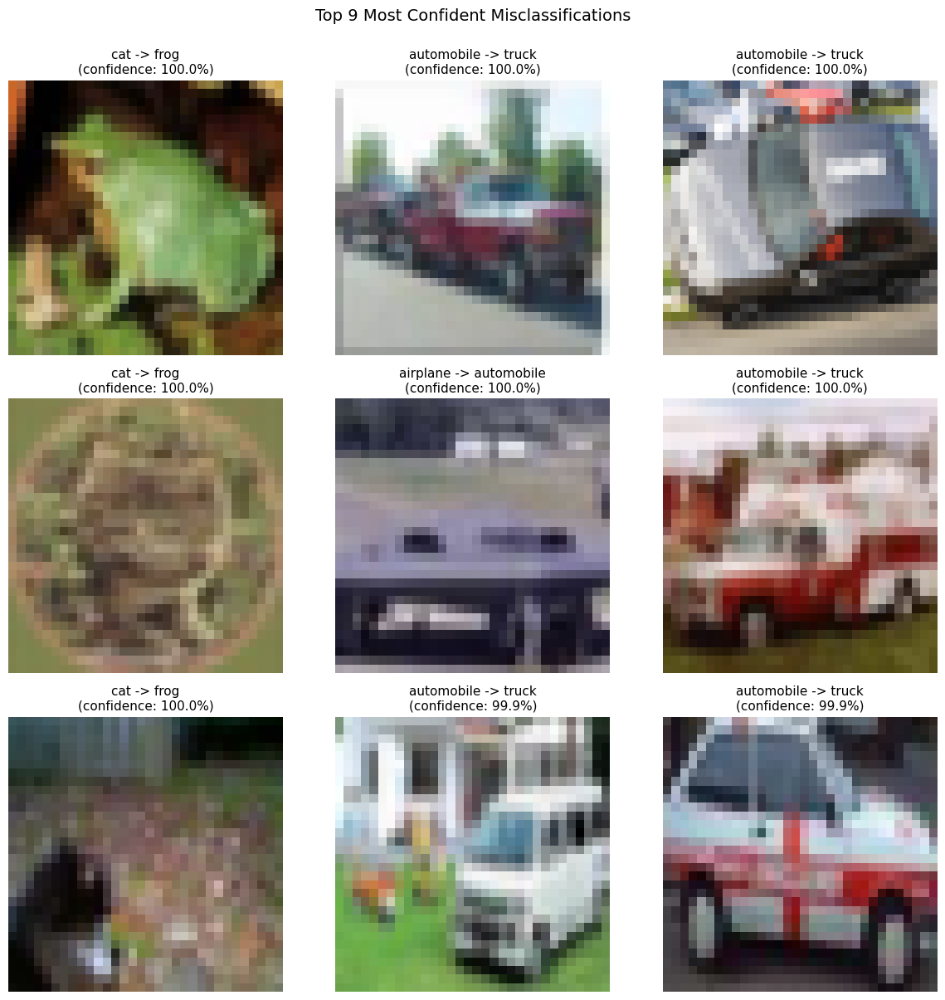
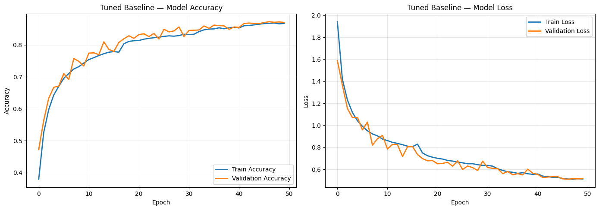
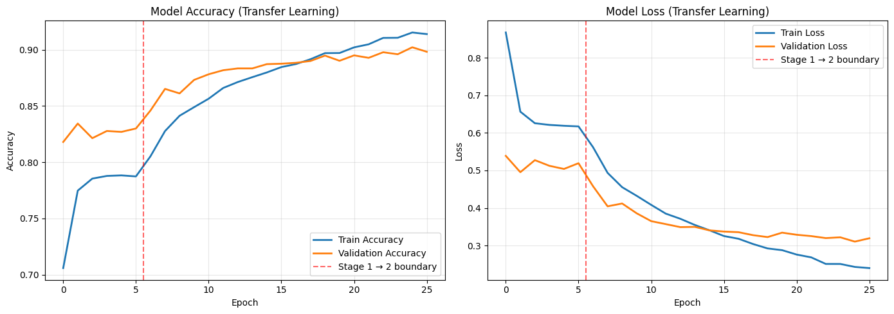
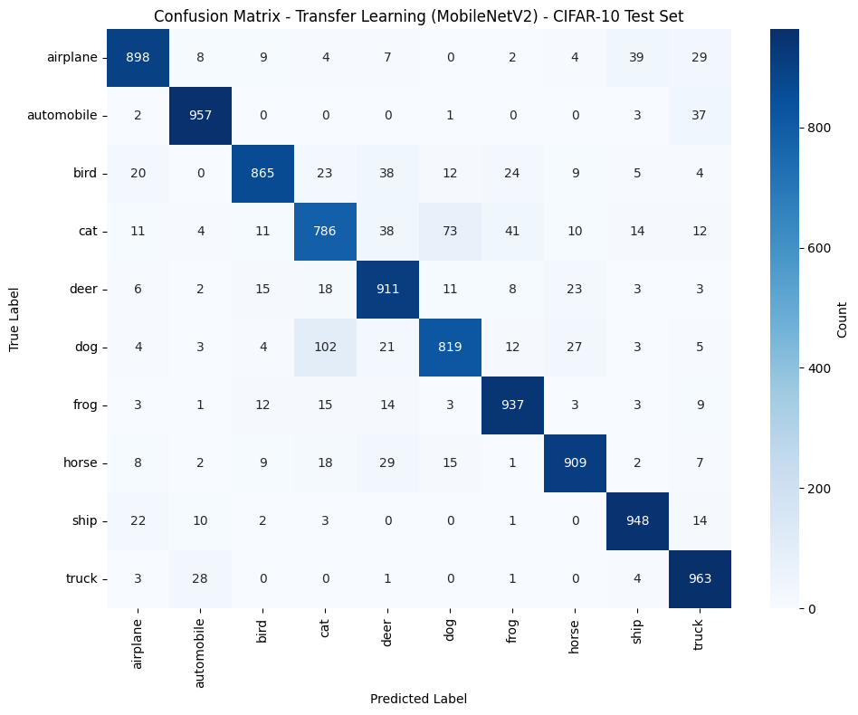
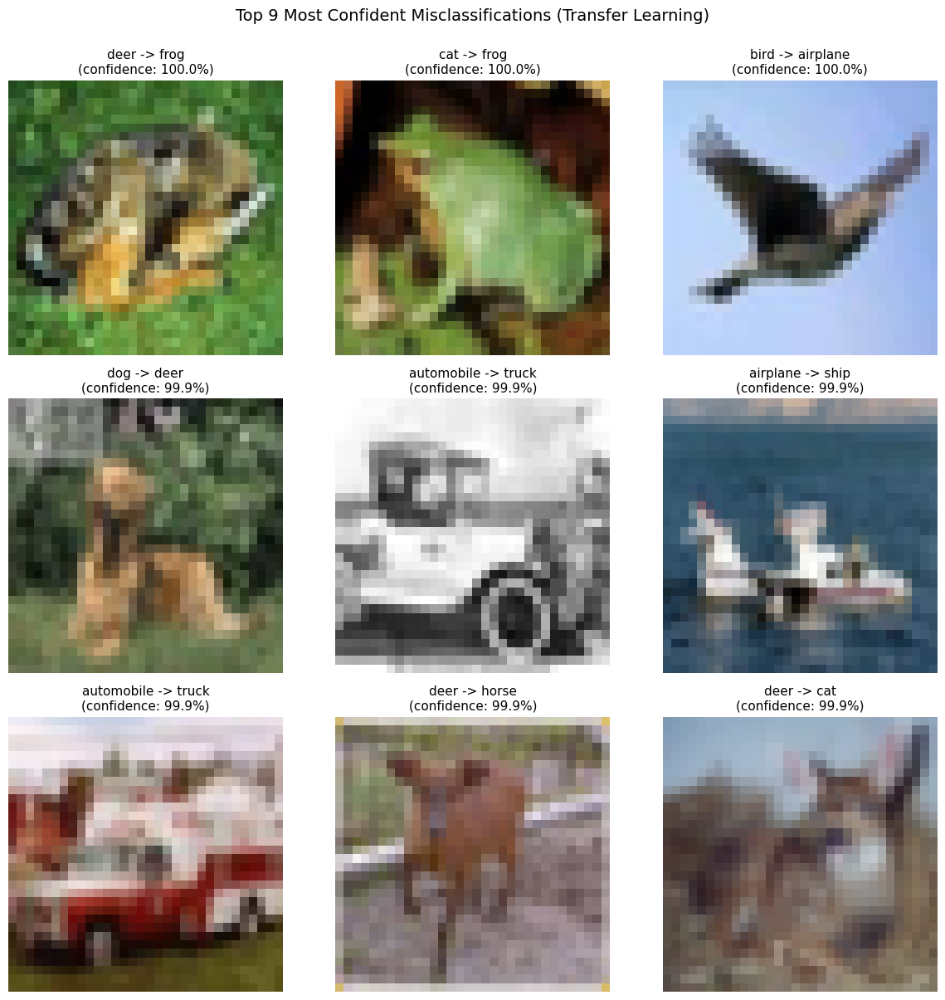
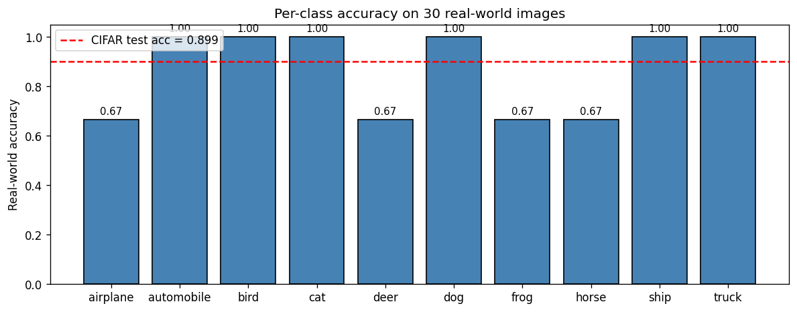
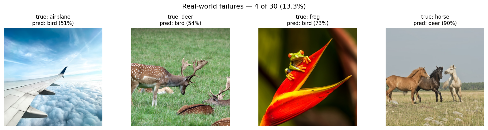

# CIFAR-10 Image Classification: From-Scratch Baselines, Automated Hyperparameter Search, and Transfer Learning, with a Bilingual Streamlit Web Application

**Course:** Machine Learning (LO 3) — Team Assignment 2
**Group:** binus-ai-2026sem3-assignment2-group04
**Authors:** _TBD — group members_
**Date:** May 2026

**Live demo:** <https://huggingface.co/spaces/ainichan/binus-ai-2026sem3-assignment2-group04>
**Source code:** <https://github.com/ainichan22/binus-ai-2026sem3-assignment2-group04>

---

## Abstract

We build, optimize, and deploy a CIFAR-10 image classifier through three complementary tracks. A from-scratch VGG-style convolutional network with a layered regularization stack reaches **0.8735** test accuracy. Automated hyperparameter search via Keras Tuner Hyperband over a seven-dimensional space lands on **0.8689** — within run-to-run noise, indicating that the hand-tuned configuration was already near the architecture's natural ceiling at 32×32 input. Transfer learning from MobileNetV2 (ImageNet pretrained, fine-tuned at 96×96 with a frozen-then-unfrozen two-stage schedule) reaches **0.8993**, a +2.58 pp absolute gain concentrated on the previously weakest classes (bird +6.20 pp, cat +4.38 pp, frog +3.14 pp). All three trained models, plus the search artifacts, are produced by reproducible Jupyter notebooks (English and Bahasa Indonesia variants). The transfer-learning model serves predictions through a Streamlit application with three pages (Predict, Metrics, About) and runtime EN/ID language switching, deployed on Hugging Face Spaces via a custom Docker image. The application includes a manual Grad-CAM implementation and aggressive caching to keep CPU inference under one second per image.

> A Bahasa Indonesia version of this report is available at [`final_report_ID.md`](final_report_ID.md).

---

## 1. Introduction

CIFAR-10 [1] remains a useful benchmark for studying optimization techniques on a constrained input. The dataset's 32×32 RGB images limit the effective receptive field that any network can build, which makes it a sharp environment for separating *what the architecture can learn* from *what better optimization can squeeze out*.

This project explores three optimization tracks on CIFAR-10 and packages the result for end-user inference:

1. **A from-scratch VGG-inspired convolutional network** (`baseline_v1`) with a deliberately layered regularization stack.
2. **Automated hyperparameter search** over the same architecture (`baseline_tuned_v2`) using Keras Tuner's Hyperband [6] implementation.
3. **Transfer learning from MobileNetV2** (`transfer_mobilenet_v1`) [3], with the standard frozen-backbone-then-fine-tune schedule and an upscaled 96×96 input.

The trained transfer-learning model is then served through a bilingual (English / Bahasa Indonesia) Streamlit web application deployed publicly on Hugging Face Spaces. The application supports image upload, sample selection, and webcam capture, and visualizes the model's attention via a manual Grad-CAM [7] overlay.

The contributions are: (a) a controlled three-way comparison on identical train/validation splits, (b) an empirical demonstration that careful hand-tuning was already within the noise floor of automated search at this architecture scale, (c) clear evidence that transfer-learning gains land disproportionately on classes the from-scratch model struggled with, and (d) an end-to-end public deployment with engineering details (caching, performance tuning, framework workarounds) documented for reproducibility.

## 2. Dataset and Preprocessing

CIFAR-10 contains 60,000 color images at 32×32 resolution split into 50,000 training and 10,000 test samples, evenly distributed across ten classes (airplane, automobile, bird, cat, deer, dog, frog, horse, ship, truck) [1]. The original test split is fixed by the dataset authors and is treated as untouched throughout this work; we never use test images for any training-time decision.

**Dataset source.** The canonical Keras helper `tf.keras.datasets.cifar10.load_data()` fetches from a University of Toronto mirror that proved unstable during the project's first training run (a scheduled outage left the mirror unreachable for several hours). All three notebooks instead load CIFAR-10 via Hugging Face Datasets (`datasets.load_dataset("cifar10")`), whose CDN-backed mirror has been reliable. The resulting NumPy arrays match the standard Keras shapes `(50000, 32, 32, 3)` uint8 and `(50000, 1)` integer labels, so downstream pipeline code is unchanged.

**Train / validation split.** Ten percent of the 50,000 training samples are stratified out as a validation set using `sklearn.model_selection.train_test_split` with `stratify=y_train` and a fixed `random_state=42`. The same seed is reused across all three optimization tracks so that every model is evaluated against the same 5,000-sample validation set and the test-set deltas are attributable to model differences rather than split variance.

**Normalization.** For the from-scratch baselines, pixel values are scaled to [0, 1] by dividing by 255. For the transfer-learning model, we apply `tf.keras.applications.mobilenet_v2.preprocess_input`, which maps [0, 255] to [-1, 1] — matching the distribution MobileNetV2 saw during ImageNet pretraining. This preprocessing happens after resize, which we elaborate on in §5.

**Augmentation.** A mild augmentation pipeline (`RandomFlip("horizontal")` + `RandomRotation(0.05)` + `RandomZoom(0.1)`) is applied only to the training set inside the `tf.data` pipeline. Validation and test datasets pass through unaugmented. We deliberately keep augmentation conservative: at 32×32 resolution, aggressive transforms (e.g. heavy rotation, color jitter, large translation) destroy discriminative features more than they regularize the model. The same augmentation is held fixed across all three tracks so that any accuracy delta is not confounded with augmentation strength.

## 3. Baseline Model: VGG-Inspired Convolutional Network

The baseline architecture is a three-block convolutional network in the VGG family [2], with two stacked 3×3 convolutions per block and progressive widening of the filter count.

### 3.1 Architecture

```
Input (32, 32, 3)
Block 1: Conv(32) → BN → Conv(32) → BN → MaxPool(2) → Dropout(0.2)
Block 2: Conv(64) → BN → Conv(64) → BN → MaxPool(2) → Dropout(0.3)
Block 3: Conv(128) → BN → Conv(128) → BN → MaxPool(2) → Dropout(0.4)
Head:    Flatten → Dense(128) → BN → Dropout(0.5) → Dense(10, softmax)
```

Total trainable parameters: ~570 K. All convolutions use 3×3 kernels with `padding='same'` and ReLU activation. L2 weight decay (`1e-4`) is applied to every weight matrix.

**Design rationale.** Three blocks is the principled upper bound for 32×32 input: each MaxPool halves the spatial dimensions (32 → 16 → 8 → 4), so a fourth block would leave a 2×2 feature map with too little spatial information. Two stacked 3×3 convolutions per block reach an effective 5×5 receptive field with fewer parameters and one extra non-linearity than a single 5×5 layer would [2]. Filter counts double across blocks (32 → 64 → 128) so per-layer cost stays roughly balanced as spatial resolution shrinks.

**Regularization stack.** Four cooperating mechanisms address overfitting on 50 K examples: (1) progressively increasing Dropout (0.2 / 0.3 / 0.4 / 0.5) places the heaviest mask near the parameter-dense classifier head [4]; (2) BatchNormalization after every Conv2D and after the dense layer stabilizes activations [5]; (3) L2 weight decay penalizes large weights; (4) the augmentation pipeline above expands the effective training distribution.

### 3.2 Training Setup

Adam optimizer, initial learning rate `1e-3`, categorical cross-entropy loss, batch size 64, and a 50-epoch budget with two callbacks: `EarlyStopping(monitor='val_loss', patience=10, restore_best_weights=True)` and `ReduceLROnPlateau(monitor='val_loss', patience=3, factor=0.5, min_lr=1e-6)`. Reproducibility is bounded — only the train/val split is seeded; weight initialization, dropout masks, and augmentation randomness are not — so test accuracy varies by roughly ±0.5 pp across runs.

### 3.3 Results

The full 50-epoch budget is used; EarlyStopping never triggers, indicating validation loss is still improving (or at least not regressing for 10 consecutive epochs) at epoch 50. Final test accuracy is **0.8735** (87.35 %). Training and validation accuracy at the final epoch are essentially identical at 0.8740 — the regularization stack works as designed, and there is no measurable overfitting.



`ReduceLROnPlateau` triggers three times during training (epochs 25, 36, and 41), producing a stair-step convergence pattern characteristic of plateau-driven LR decay. Each drop yields a small but visible improvement in validation loss for 2–3 epochs before plateauing again.

**Per-class results.** Vehicle classes dominate the top of the F1 ranking: ship 0.933, automobile 0.933, horse 0.911, truck 0.901, frog 0.893, airplane 0.879. Animal classes occupy the bottom: cat 0.755, dog 0.820, bird 0.836. Cat is the worst case — only 70.4 % of true cats are recovered (recall 0.704), with the remaining 30 % distributed across visually adjacent animal classes (dog, bird, frog).



**High-confidence misclassifications.** Examining the nine test images where the baseline was most confident in a wrong prediction reveals three recurring failure modes: (1) pose ambiguity — four-legged animals shot from non-standard angles trip the cat / dog / deer cluster; (2) background dominance — birds against sky get pulled toward airplane, birds in foliage drift toward frog or deer; (3) shape over texture — bulky-profile cars (SUVs, pickups) get classified as truck. These are inherent to CIFAR-10 at 32×32 resolution, not failures of the specific architecture.



## 4. Hyperparameter Tuning with Keras Tuner Hyperband

We applied automated hyperparameter search to the baseline architecture using Keras Tuner's Hyperband implementation [6]. The motivation is not to beat transfer learning — that ceiling is bounded by 32×32 input scale on this architecture — but to quantify how much accuracy headroom is reachable through better hyperparameters alone.

### 4.1 Search Space

Seven hyperparameters were exposed:

| Hyperparameter | Range | Sampling |
|---|---|---|
| `learning_rate` | 1e-4 – 1e-2 | log-uniform |
| `dropout_block1` | 0.1 – 0.4 | step 0.1 |
| `dropout_block2` | 0.2 – 0.5 | step 0.1 |
| `dropout_block3` | 0.3 – 0.5 | step 0.1 |
| `weight_decay` (L2) | 1e-5 – 1e-3 | log-uniform |
| `dense_units` | 64 / 128 / 256 | choice |
| `optimizer` | adam / adamw / sgd | choice |

The classifier-head dropout (0.5 before the final Dense) is *not* tuned: that location is the highest overfitting risk in the network, and the literature-standard 0.5 [4] is well-validated. Augmentation is also held fixed.

### 4.2 Hyperband Configuration

`max_epochs=20`, `factor=3`, `objective='val_accuracy'`, `seed=42`. Hyperband automatically allocates the bracket structure; the search produced 30 distinct trials over a 57-minute wall-clock window on a Colab T4. Each trial used an inner `EarlyStopping(patience=3)` to abort obviously bad candidates early.

### 4.3 Search Results

The top five trials by validation accuracy (within the 20-epoch search horizon):

| Rank | val_acc | learning_rate | optimizer | dense_units | weight_decay | dropout (b1/b2/b3) |
|---|---|---|---|---|---|---|
| 1 | 0.8148 | 6.68e-04 | adam | 128 | 1.40e-04 | 0.1 / 0.4 / 0.4 |
| 2 | 0.7984 | 1.25e-03 | adamw | 256 | 1.90e-04 | 0.1 / 0.3 / 0.3 |
| 3 | 0.7862 | 9.70e-03 | sgd | 256 | 1.62e-04 | 0.2 / 0.2 / 0.5 |
| 4 | 0.7828 | 1.45e-03 | adam | 256 | 7.73e-05 | 0.1 / 0.4 / 0.5 |
| 5 | 0.7550 | 2.64e-03 | adam | 256 | 9.17e-05 | 0.1 / 0.2 / 0.5 |

Adam dominates the leaderboard, the winning learning rate (6.68e-04) sits below the hand-tuned default (1e-3), and the winning weight decay (1.40e-04) is essentially the hand-tuned value (1e-4). Dropout patterns vary widely across the top five — the model is fairly insensitive to per-block dropout magnitude as long as it is non-trivial.

### 4.4 Final Retrain and Outcome

The winning configuration was retrained from scratch for the full 50-epoch budget with the same callbacks as the baseline. Final test accuracy is **0.8689** (val 0.8726).



This is **0.46 pp below the hand-tuned baseline's 0.8735** — well within the ±0.5 pp run-to-run noise floor for this architecture. The interpretation is not that Hyperband failed; it is that the hand-tuned hyperparameters from `01_baseline_EN.ipynb` were already near the local optimum reachable within this search space. Per-class results follow the same pattern as the baseline: cat remains the worst (F1 0.750), vehicle classes remain the strongest.


**Takeaway.** When automated search results match the hand-tuned configuration within noise, that is *evidence about the architecture, not the search method*. The conclusion is that further optimization headroom on this architecture at 32×32 input is small; meaningful gains require changing the architecture itself.

## 5. Transfer Learning with MobileNetV2

Having confirmed that the from-scratch architecture is optimization-saturated, we turn to a pretrained backbone. MobileNetV2 [3] is the natural choice: it is small enough to fine-tune on a single Colab T4 GPU, ImageNet-pretrained, and well-supported in the Keras applications API.

### 5.1 Architecture and Preprocessing Adjustments

```
Input (96, 96, 3)
  → MobileNetV2 backbone (ImageNet pretrained, ~2.26 M params)
  → GlobalAveragePooling2D
  → Dropout(0.3)
  → Dense(10, softmax)
```

**Input upscaling.** CIFAR-10's native 32×32 resolution is below MobileNetV2's minimum supported spatial size of 96×96. Below this threshold the network refuses to build because its stride-2 layers would collapse the feature map to a degenerate size. Each image is therefore resized via bilinear interpolation to 96×96 inside the `tf.data` pipeline. The upscaling does not add information, but it ensures MobileNetV2's pretrained convolutional filters operate at a feature map resolution where their stride patterns are meaningful.

**Pixel range.** `tf.keras.applications.mobilenet_v2.preprocess_input` is applied after resize, mapping the [0, 255] integer pixel range to [-1, 1] float — matching the distribution MobileNetV2 was pretrained on. The order matters: the input must be in [0, 255] when `preprocess_input` is called.

**Critical detail — `training=False`.** When the backbone is invoked inside the new functional model, the call is `base_model(inputs, training=False)`. This forces the BatchNormalization layers inside MobileNetV2 to use their stored ImageNet running statistics rather than recomputing batch statistics from CIFAR. Without this single flag, the BN statistics get overwritten by CIFAR's small-batch statistics during the first few epochs and accuracy collapses by 5–10 pp. This is the most failure-prone step in the entire pipeline.

### 5.2 Two-Stage Training Schedule

**Stage 1 (frozen backbone).** All MobileNetV2 weights are frozen. Only the new head's parameters update — `Dropout` is non-parametric, so this is just the final `Dense(10)` layer's ~12 K parameters. Optimizer Adam, learning rate `1e-3`, 10-epoch budget with `EarlyStopping(patience=4)`. The head saturates quickly because the frozen backbone produces fixed features and the only knob is a linear classifier on a 1280-dimensional representation. EarlyStopping triggered at epoch 6, with best validation accuracy 0.8344.

**Stage 2 (fine-tune top 30 layers).** The deepest 30 layers of the MobileNetV2 backbone are unfrozen. Earlier layers (edge detectors, simple textures) stay frozen to preserve the broad ImageNet prior; the deepest layers — which encode high-level concepts like object parts and complex textures — are nudged toward CIFAR's specifics. Critically, all `BatchNormalization` layers stay frozen even when their parent block is unfrozen, both via the `training=False` call-site flag and by explicitly setting `layer.trainable = False` for each BN layer. Learning rate drops 100× to `1e-5` (large LR would shred the pretrained weights), and the budget extends to 20 additional epochs with both `EarlyStopping(patience=6)` and `ReduceLROnPlateau(patience=3, factor=0.5, min_lr=1e-7)`.

Stage 2 ran the full 20 epochs; ReduceLROnPlateau halved the LR from 1e-5 to 5e-6 mid-stage. Best validation accuracy reached 0.9022 at epoch 25 of the combined training run.



The dashed vertical line marks the Stage 1 → Stage 2 boundary. The visible discontinuity at the boundary is the head adjusting to its new (now-trainable) inputs.

### 5.3 Results

Final test accuracy is **0.8993** — a +2.58 pp absolute improvement over the from-scratch baseline.



The final train/validation gap is 0.0157 (1.6 pp). Modest overfitting is starting to appear by the end of Stage 2, but well under the threshold where the head's Dropout(0.3) loses control. Continuing further would likely widen the gap and degrade validation accuracy.

The high-confidence misclassifications (Figure below) follow the same animal-class clusters as the baseline, but with notably lower confidence values — the fine-tuned model is better calibrated.



## 6. Comparison and Discussion

### 6.1 Headline Comparison

| Model | Test accuracy | Trainable params | Epochs | Notes |
|---|---|---|---|---|
| `baseline_v1` (hand-tuned) | 0.8735 | ~570 K | 50 | VGG-style, manual HP |
| `baseline_tuned_v2` (Hyperband) | 0.8689 | 552 K | 50 | Same architecture, searched HP |
| `transfer_mobilenet_v1` | **0.8993** | ~1.52 M (Stage 2) | 6 + 20 | MobileNetV2 → fine-tune top 30 |

### 6.2 Per-Class F1 Deltas

| Class | Baseline | Tuned | Transfer | Δ (transfer − baseline) |
|---|---|---|---|---|
| airplane | 0.8792 | 0.8817 | 0.9084 | +2.92 pp |
| automobile | 0.9331 | 0.9368 | 0.9499 | +1.68 pp |
| **bird** | 0.8358 | 0.8256 | 0.8978 | **+6.20 pp** |
| **cat** | 0.7546 | 0.7497 | 0.7984 | +4.38 pp |
| deer | 0.8624 | 0.8548 | 0.8849 | +2.25 pp |
| dog | 0.8196 | 0.8091 | 0.8469 | +2.73 pp |
| frog | 0.8931 | 0.8779 | 0.9245 | +3.14 pp |
| horse | 0.9105 | 0.9015 | 0.9159 | +0.54 pp |
| ship | 0.9332 | 0.9312 | 0.9368 | +0.36 pp |
| truck | 0.9012 | 0.9087 | 0.9246 | +2.34 pp |
| **macro avg** | 0.8723 | 0.8677 | 0.8988 | **+2.65 pp** |

### 6.3 Discussion

Three findings stand out.

**Hand-tuning was already near-optimal for this architecture.** The Hyperband-searched configuration (0.8689) sits within the ±0.5 pp run-to-run noise of the hand-tuned baseline (0.8735). This negative result is informative: it tells us the architecture is the binding constraint, not the hyperparameters. A meaningful accuracy lift from this point requires either changing the architecture (more capacity, different inductive biases) or feeding richer data (higher input resolution, more training samples).

**Transfer learning gains land disproportionately on the worst baseline classes.** The largest improvements are on classes the baseline struggled with — bird (+6.20 pp), cat (+4.38 pp), frog (+3.14 pp) — while classes the baseline already handled well (ship +0.36 pp, horse +0.54 pp) barely move. This pattern is consistent with ImageNet's distribution: ImageNet contains many bird species and many cat varieties at high resolution, so MobileNetV2 brings priors specifically about visual structures that 50 K low-resolution CIFAR examples cannot teach from scratch. Vehicle classes, in contrast, were already at the data-distribution ceiling at 32×32 — there is nothing in MobileNetV2's prior that helps a model already getting 93 % F1 on ships.

**Transfer learning is not "free" accuracy — preprocessing parity is critical.** The 96×96 resize, the `[0, 255] → [-1, 1]` mapping via `preprocess_input`, the order of operations (resize before preprocess), the `training=False` flag on the backbone call site, and the explicit BN-layer freezing during fine-tuning are all load-bearing. Any single deviation produces a 5–10 pp accuracy regression. We document each of these explicitly in the notebook for future replicators.

## 7. Web Application Design and Deployment

### 7.1 Application Architecture

The trained transfer-learning model is served through a Streamlit application organized as three pages plus shared utilities.

```
app/
├── app.py                      # entry point + sidebar language selector
├── i18n/
│   ├── __init__.py             # t() + language_selector()
│   ├── en.json                 # 37 keys, English
│   └── id.json                 # 37 keys, Bahasa Indonesia (parity verified)
├── utils/
│   ├── preprocess.py           # mirrors training: center-crop → resize 96 → preprocess_input
│   ├── model_loader.py         # @st.cache_resource model loading, HF/local path search
│   └── gradcam.py              # manual Grad-CAM (no third-party Grad-CAM library)
├── pages/
│   ├── 1_Predict.py            # upload / sample / camera → top-3 + Grad-CAM overlay
│   ├── 2_Metrics.py            # training curves, per-class report, confusion matrix
│   └── 3_About.py              # architecture, references, GitHub link
└── samples/                    # 10 CIFAR test images (one per class)
```

**Internationalization.** All user-facing strings flow through a `t(key)` helper that loads from `en.json` or `id.json` based on `st.session_state.lang`. The two JSON files share 37 keys verified at startup. The language selector lives in the sidebar and is rendered on every page so language changes apply consistently across navigation.

**Preprocessing parity.** `app/utils/preprocess.py` implements the exact pipeline used in the transfer-learning notebook (center-crop to square → resize 96×96 → `preprocess_input`). Center-cropping before resize is an addition specific to inference: real-world photos rarely have square aspect ratios, and naive resize would distort them in ways the model never saw at training time. CIFAR's training images are square by construction, so center-cropping makes inference inputs match the training distribution as closely as possible.

**Grad-CAM implementation.** A manual implementation in `app/utils/gradcam.py` avoids dependence on `tf-keras-vis` (which has had compatibility issues across recent TensorFlow releases). The target layer is MobileNetV2's `Conv_1` — the final 1×1 convolution before the global average pooling, which is the standard Grad-CAM target for this backbone [7].

### 7.2 Implementation Challenges

Two non-obvious problems surfaced during development.

**Keras 3 nested sub-model limitation.** The straightforward Grad-CAM construction `tf.keras.Model(inputs=outer_model.inputs, outputs=[target_conv.output, outer_model.output])` raised `ValueError: Output with path 0 is not connected to inputs` when the target layer lived inside a nested sub-model (MobileNetV2 wrapped inside the outer Functional model). Keras 3's Functional API checks for a single contiguous symbolic graph from inputs to all outputs, and the intermediate tensor inside the wrapper cannot be reached this way. Our workaround constructs a two-stage forward: an inner Functional model from the sub-model's input to `(target_conv_output, sub_model_output)`, then a manual loop that applies the outer head's GAP / Dropout / Dense layers to finish the prediction. The whole forward runs inside a single `tf.GradientTape`, so the gradient of the predicted-class logit with respect to the conv-layer activations remains computable.

**Single-image inference latency.** The first deployed version exhibited per-prediction latency exceeding one minute on Apple Silicon CPU. The dominant cost was `model.predict(batch, verbose=0)` — a method designed for batched inference with a progress bar, which sets up an internal `tf.data` pipeline on every call. For single-image inference, replacing `model.predict(x)` with `model(x, training=False).numpy()` cuts wall-clock time by 10–100×. Combined with `@st.cache_resource` decorating both the model loader and the Grad-CAM sub-model construction, plus a single dummy forward pass at load time to pay graph-tracing cost upfront, per-prediction latency is now under one second on the same CPU.

### 7.3 Deployment to Hugging Face Spaces

Hugging Face Spaces removed Streamlit as a first-class SDK during this project. Streamlit applications now deploy via the Docker SDK with a custom `Dockerfile`. Our deployment image is based on `python:3.11-slim`, runs as a non-root user (HF Spaces convention, UID 1000), installs requirements via `pip --user`, and launches Streamlit on port 7860 with the iframe-compatible flags `--server.enableCORS=false` and `--server.enableXsrfProtection=false`. The latter is required because HF Spaces serves the application inside an iframe; Streamlit's default XSRF protection treats the upload POST as a cross-origin request and rejects it with HTTP 403. Disabling XSRF is safe for this stateless public demo.

The model artifacts (`transfer_mobilenet_v1.keras` plus three history pickles) are stored in the HF Space repository — uploaded directly via the HF Files UI rather than committed to the GitHub source repository, which keeps the source repo small. The Docker `COPY . .` step then includes them in the image at build time.

The live deployment is at <https://huggingface.co/spaces/ainichan/binus-ai-2026sem3-assignment2-group04>.

## 8. Real-World Image Testing

### 8.1 Methodology

The CIFAR-10 test set is drawn from the same low-resolution distribution as the training set. To measure how the model generalizes beyond that distribution we collected **30 external images** (3 per class, 10 classes) from public photo sources (Unsplash, Pexels, free Google Images results), explicitly excluding (a) CIFAR-10 originals and derivatives and (b) AI-generated images. Each image was classified by `transfer_mobilenet_v1.keras` after the same preprocessing pipeline used at training time (`center_crop_square → resize 96×96 → preprocess_input`); top-3 predictions, top-1 confidence, and correctness were recorded. The full per-image table lives at `report/realworld_results.csv`.

### 8.2 Aggregate Results

| Metric | Real-world (n=30) | CIFAR test (n=10 000) | Δ |
|---|---|---|---|
| Overall accuracy | **0.8667** (26 / 30) | 0.8993 | -3.26 pp |
| Mean confidence — correct predictions | 0.967 | — | — |
| Mean confidence — incorrect predictions | 0.671 | — | — |

The model retains most of its CIFAR-test accuracy on out-of-distribution natural photos: the domain gap is **3.26 percentage points**, smaller than initially expected. ImageNet-pretrained features appear to generalize reasonably well to real-world inputs, partly because MobileNetV2's pretrained weights were learned on natural high-resolution photos in the first place — the model's intuition for "what a cat looks like" was never bound to 32×32 thumbnails alone.

The confidence-calibration result is the most encouraging finding: when the model is wrong, it tends to know it is wrong. Mean confidence on incorrect predictions is 0.67, versus 0.97 on correct predictions. A simple confidence threshold around 0.85 would route most failures to "uncertain" — a useful property for production deployment.

### 8.3 Per-Class Results



| Class | Real-world (n=3) | CIFAR-test F1 (transfer model) | Notes |
|---|---|---|---|
| automobile | 3 / 3 (100 %) | 0.95 | strong on both distributions |
| bird | 3 / 3 (100 %) | 0.90 | CIFAR-weak class lifted by transfer learning, RW-perfect |
| cat | 3 / 3 (100 %) | 0.80 | CIFAR-weakest class, RW-perfect |
| dog | 3 / 3 (100 %) | 0.85 | similarly |
| ship | 3 / 3 (100 %) | 0.94 | strong on both |
| truck | 3 / 3 (100 %) | 0.92 | strong on both |
| airplane | 2 / 3 (67 %) | 0.91 | one failure: `airplane_01` → bird |
| deer | 2 / 3 (67 %) | 0.88 | one failure: `deer_01` → bird |
| frog | 2 / 3 (67 %) | 0.92 | one failure: `frog_02` → bird |
| horse | 2 / 3 (67 %) | 0.92 | one failure: `horse_03` → deer |

A counter-intuitive pattern: classes the CIFAR test set marked as *weakest* (cat, dog, bird) all achieved 100 % real-world accuracy here, while several CIFAR-strong classes (airplane, deer, frog, horse) each missed exactly once. The obvious caveat: **at 3 images per class, per-class accuracy has very wide confidence intervals** — a 2 / 3 observation is consistent with population accuracy anywhere from ~10 % to ~99 %. The aggregate 26 / 30 number is the only one with meaningful resolution; per-class observations should be read as illustrative rather than statistically conclusive.

### 8.4 Failure Modes



The four failure cases reveal a single dominant pattern: **three of four wrong predictions chose `bird`**, and the fourth chose `deer`.

| File | True | Predicted | Confidence | Top-3 |
|---|---|---|---|---|
| `airplane_01.jpg` | airplane | **bird** | 0.51 | bird → airplane → cat |
| `deer_01.jpg` | deer | **bird** | 0.54 | bird → deer → cat |
| `frog_02.jpg` | frog | **bird** | 0.74 | bird → ship → dog |
| `horse_03.jpg` | horse | **deer** | 0.90 | deer → horse → bird |

Three of four failures land in a 0.51–0.74 confidence band — classic "uncertain" output where the top-2 are nearly tied. `airplane_01 → bird` and `deer_01 → bird` are essentially coin flips between the correct and predicted class (0.51 / 0.48 and 0.54 / 0.46 respectively). The bird-leaning bias on uncertain inputs may reflect a property of MobileNetV2's pretraining: ImageNet contains 59 bird species classes (of 1 000 total), so the bird feature subspace is large, and a non-canonical real-world photo may activate it more strongly than CIFAR's distribution would suggest.

The single high-confidence error — `horse_03 → deer` at 0.90 confidence — is the most interesting failure. Horse–deer is one of the well-known difficult pairs in CIFAR-10 (both four-legged outdoor animals), and the high confidence indicates the model is confidently wrong here rather than merely uncertain. This is a genuine classification mistake, not a calibration issue.

### 8.5 Implications for the Deployed Application

The Streamlit Predict page already includes a disclaimer about the domain gap (visible at the bottom of the prediction view). Combined with the empirical finding that incorrect predictions are typically low-confidence, the existing Top-3 bar-chart UI is already well-suited to the calibration profile we observed: when the second and third options are close to the first, the user can read that ambiguity directly rather than receive a single overconfident assertion.

For the report's broader narrative: real-world accuracy of 86.67 % on 30 images is, with the sample-size caveat, a reasonable demonstration that ImageNet-pretrained features generalize past the original CIFAR distribution. It does *not* mean the model is robust in any production sense — the small sample, the curated source images, and the absence of adversarial conditions (occlusion, lighting variance, motion blur) all argue for further evaluation before any real deployment.

## 9. Conclusion and Future Work

We trained three models on CIFAR-10 and arrived at a clean ordering: from-scratch VGG-style baseline (0.8735) ≈ Hyperband-searched baseline (0.8689) ≪ MobileNetV2 transfer learning (0.8993). The negative result on hyperparameter search is informative: at this architecture and input resolution, hand-tuning was already at the noise floor, and meaningful accuracy gains required changing the architecture rather than its hyperparameters. Transfer learning's +2.58 pp gain landed disproportionately on the previously weakest classes (bird, cat, frog), consistent with ImageNet bringing class-specific priors that 50 K CIFAR examples cannot teach from scratch.

The trained transfer-learning model is served through a bilingual (EN / ID) Streamlit application deployed publicly on Hugging Face Spaces via a custom Docker image. The application supports image upload, sample selection, and webcam capture, and visualizes model attention via a manual Grad-CAM implementation. Per-prediction latency on CPU is under one second after a series of TensorFlow / Streamlit performance fixes documented in §7.2.

**Future work.** Three directions look promising. (1) **Stronger augmentation** — Mixup, CutMix, or RandAugment, possibly combined with a longer training schedule to absorb the additional regularization pressure. (2) **Architecture search beyond hyperparameters** — replace `Flatten + Dense` with `GlobalAveragePooling2D` (cuts ~262 K parameters), or try EfficientNet / ConvNeXt as the transfer-learning backbone. (3) **Domain adaptation for real-world inputs** — fine-tune a small adapter head on a labeled set of high-resolution external images, or apply test-time augmentation (multi-crop averaging) to mitigate the domain gap quantified in §8.

## References

[1] A. Krizhevsky, "Learning Multiple Layers of Features from Tiny Images," Tech. Rep., Univ. of Toronto, 2009.

[2] K. Simonyan and A. Zisserman, "Very Deep Convolutional Networks for Large-Scale Image Recognition," in *International Conference on Learning Representations (ICLR)*, 2015.

[3] M. Sandler, A. Howard, M. Zhu, A. Zhmoginov, and L.-C. Chen, "MobileNetV2: Inverted Residuals and Linear Bottlenecks," in *IEEE Conference on Computer Vision and Pattern Recognition (CVPR)*, 2018, pp. 4510–4520.

[4] N. Srivastava, G. Hinton, A. Krizhevsky, I. Sutskever, and R. Salakhutdinov, "Dropout: A Simple Way to Prevent Neural Networks from Overfitting," *Journal of Machine Learning Research*, vol. 15, no. 1, pp. 1929–1958, 2014.

[5] S. Ioffe and C. Szegedy, "Batch Normalization: Accelerating Deep Network Training by Reducing Internal Covariate Shift," in *International Conference on Machine Learning (ICML)*, 2015, pp. 448–456.

[6] L. Li, K. Jamieson, G. DeSalvo, A. Rostamizadeh, and A. Talwalkar, "Hyperband: A Novel Bandit-Based Approach to Hyperparameter Optimization," *Journal of Machine Learning Research*, vol. 18, no. 1, pp. 6765–6816, 2017.

[7] R. R. Selvaraju, M. Cogswell, A. Das, R. Vedantam, D. Parikh, and D. Batra, "Grad-CAM: Visual Explanations from Deep Networks via Gradient-Based Localization," in *IEEE International Conference on Computer Vision (ICCV)*, 2017, pp. 618–626.

[8] J. Deng, W. Dong, R. Socher, L.-J. Li, K. Li, and L. Fei-Fei, "ImageNet: A Large-Scale Hierarchical Image Database," in *IEEE Conference on Computer Vision and Pattern Recognition (CVPR)*, 2009, pp. 248–255.

[9] M. Abadi *et al.*, "TensorFlow: Large-Scale Machine Learning on Heterogeneous Distributed Systems," 2015. [Online]. Available: <https://www.tensorflow.org/>

[10] F. Chollet *et al.*, "Keras," 2015. [Online]. Available: <https://keras.io>

[11] T. O'Malley *et al.*, "Keras Tuner," 2019. [Online]. Available: <https://github.com/keras-team/keras-tuner>

[12] Streamlit Inc., "Streamlit — A faster way to build and share data apps." [Online]. Available: <https://streamlit.io>

[13] Hugging Face, "Spaces — Host machine learning demos." [Online]. Available: <https://huggingface.co/spaces>

[14] Hugging Face, "Datasets — A community library for natural language processing." [Online]. Available: <https://huggingface.co/docs/datasets>
